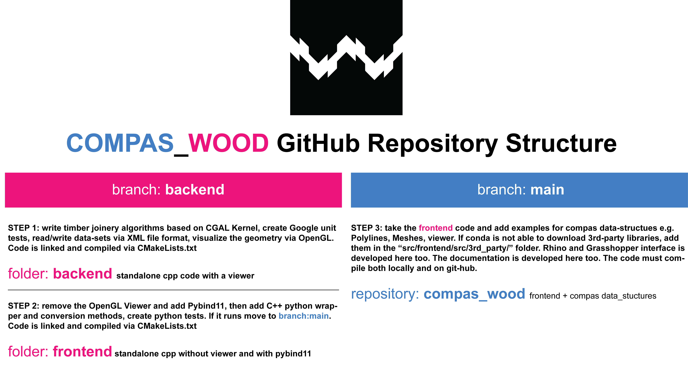

# COMPAS_WOOD - Project for Generating Timber Joints

Author: [Petras Vestartas](https://petrasvestartas.com/Petras-Vestartas-CV)

## Interface compas_wood

### Installation

##### Windows

    conda create -n wood-dev python=3.8 mpir mpfr boost-cpp eigen=3.4 cgal-cpp=5.5 pybind11 compas compas_view2 --yes
    conda activate wood-dev
    git clone https://github.com/petrasvestartas/compas_wood
    cd compas_wood
    pip install -e .

##### Mac

    conda create -n wood-dev python=3.8 gmp mpfr boost-cpp eigen=3.4 cgal-cpp=5.5 pybind11 compas compas_view2 --yes
    conda activate wood-dev
    git clone https:/github.com/petrasvestartas/compas_wood
    cd compas_wood 
    pip install -e . 

* Note: Be aware that "pip install -e ." command will take some time to run without any messages. This is normal for C++ compilation that is done only once.

##### If you install this library on a new computer that did not have Anaconda Prompt or VScode follow these steps

* Install Anaconda Prompt: https://www.anaconda.com/
* Type in the anaconda prompt: "conda config --add channels conda-forge"
* Add this environment path. On windows search type "Edit the system environmental variables", click "Environmental Variables..", under second tab click "path", then edit and add the following path: "C:\ProgramData\Anaconda3\Scripts". This process can be avoided if during installation of Anaconda Prompt you ticked the option to the Anaconda Prompt to the Environmental Variables.
* Open Anaconda Prompt terminal and update conda:
    conda activate base
    conda update --all

##### If you never used VSCode

* Install VSCode: https://code.visualstudio.com/Download
* Install VSCode Extensions: Python
* Launch VScode, type CTRL+SHIFT+P and >Python: Create Terminal

##### Video
https://user-images.githubusercontent.com/18013985/147587822-cfb43c96-4a81-4b89-987f-8d201ec2e5ba.mp4

##### ToDo
- [ ] recenter geometry before processing
- [ ] ctypes floating number conversion, currently precision is lost
- [ ] ctypes user tolerance

## Examples
- [x] "tests/compas_wood_1_test.py" - test if the library is loading
- [x] "tests/compas_wood_2_read_xml.py" - get data-set a set of polylines and display in viewer
- [x] "tests/compas_wood_3_joints.py" - get connection-areas between timber plates
- [x] "tests/compas_wood_4_rtree.py" - get neighbors of an element
- [x] "tests/compas_wood_5_get_connection_zones.py" - generate timber joints
- [x] "tests/compas_wood_6_closed_mesh_from_polylines.py" - create a solid mesh from polylines with holes
- [x] "tests/compas_wood_7_mooc_homework.py" - create a special connection of the Vidy project

## Tests

## Rhino Implementation

