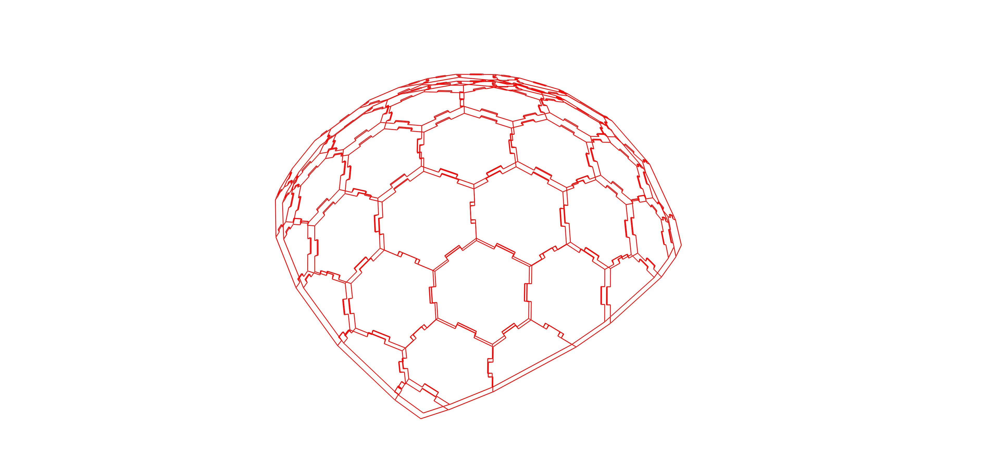

********************************************************************************
Examples
********************************************************************************

.. toctree::
   :maxdepth: 1
   :titlesonly:
   :glob:

   examples/*

Example - test_side_side_connections.py
""""""""""""""
* **Description:** generates joints for elements connected side-to-side. Input and output images are shown below.
* **Input:** a list of polylines (the list of top and bottom outlines are stored sequentially (0-top, 0-bottom, 1-top, 1-bottom ... N-top, N-bottom))
* **Output:** a list of polylines with added joints
* **Tests:** for testing purpose the polylines are stored in compas_wood.data files. Input and output geomety is visualized below.

.. code-block:: python

   #compas_wood
   from compas_wood.joinery import wrapper_test
   from compas_wood.joinery import get_connection_zones
   from compas_wood.data.joinery_solver_sideside import *

   #viewer
   from compas_wood.viewer_helpers import display

   # ==============================================================================
   # Create a list of polyline pairs - input, then generate joints and display them
   # ==============================================================================
   def test_side_side_connections():

      # Get a list of polyline pairs
      input = SS0();

      # Generate connections
      result = get_connection_zones(input)

      # Display via Compas_View2
      display([], result)

      #output
      return result

   # ==============================================================================
   #call the compas_wood methods
   # ==============================================================================
   wrapper_test()
   test_side_side_connections()

SS0
""""""""""""""

