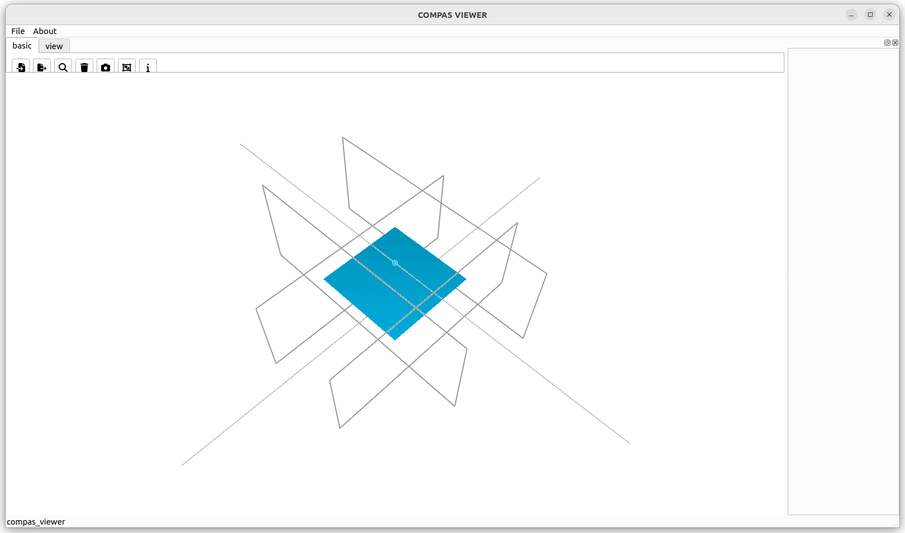

# Beam Volumes Cross

Example demonstrating beam volume generation with cross joints.

<figure markdown="span">
  { loading=lazy style="max-height: 400px" }
</figure>

```python
from compas.geometry import Polyline
from compas_wood.binding import beam_volumes


input_polylines = [
    Polyline([
        [-5, 0, 0],
        [5, 0, 0]
    ]),
    Polyline([
        [0, -5, 1],
        [0, 5, 1]
    ]),
]
input_polylines_segment_radii = []

for i in range(len(input_polylines)):
    input_polyline_segment_radii = []
    for j in range(len(input_polylines[i].points)):
        input_polyline_segment_radii.append(1)
    input_polylines_segment_radii.append(input_polyline_segment_radii)

input_polylines_segment_direction = []


index_polylines, index_polylines_segment, distance, point_pairs, volume_pairs, joints_areas, joints_types = beam_volumes(
        input_polylines,
        input_polylines_segment_radii,
        input_polylines_segment_direction,
        input_min_distance=2,
        input_volume_length=5
)
```
