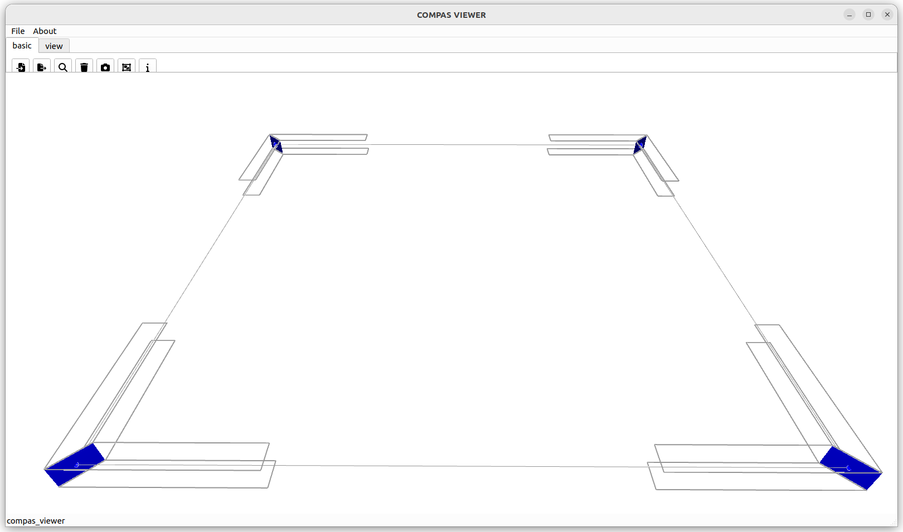

# Beam Volumes Frame

Example demonstrating beam volume generation for frame structures.

<figure markdown="span">
  { loading=lazy style="max-height: 400px" }
</figure>

```python
from compas.geometry import Polyline
from compas_wood.binding import beam_volumes


input_polylines = [
    Polyline([[-5, -5, 0], [-5, 5, 0]]),
    Polyline([[-5, 5, 0], [5, 5, 0]]),
    Polyline([[5, 5, 0], [5, -5, 0]]),
    Polyline([[5, -5, 0], [-5, -5, 0]]),
]

input_polylines_segment_radii = []
for i in range(len(input_polylines)):
    input_polyline_segment_radii = []
    for j in range(len(input_polylines[i].points)):
        input_polyline_segment_radii.append(0.2)
    input_polylines_segment_radii.append(input_polyline_segment_radii)

input_polylines_segment_direction = []
for i in range(len(input_polylines)):
    input_polyline_segment_direction = []
    for j in range(len(input_polylines[i].points)-1):
        input_polyline_segment_direction.append([0, 0, 1])
    input_polylines_segment_direction.append(input_polyline_segment_direction)


index_polylines, index_polylines_segment, distance, point_pairs, volume_pairs, joints_areas, joints_types = beam_volumes(
        input_polylines,
        input_polylines_segment_radii,
        input_polylines_segment_direction,
        input_allowed_types_per_polyline=[0],
        input_min_distance=1,
        input_volume_length=5,
        input_cross_or_side_to_end=2.01,
)
```
