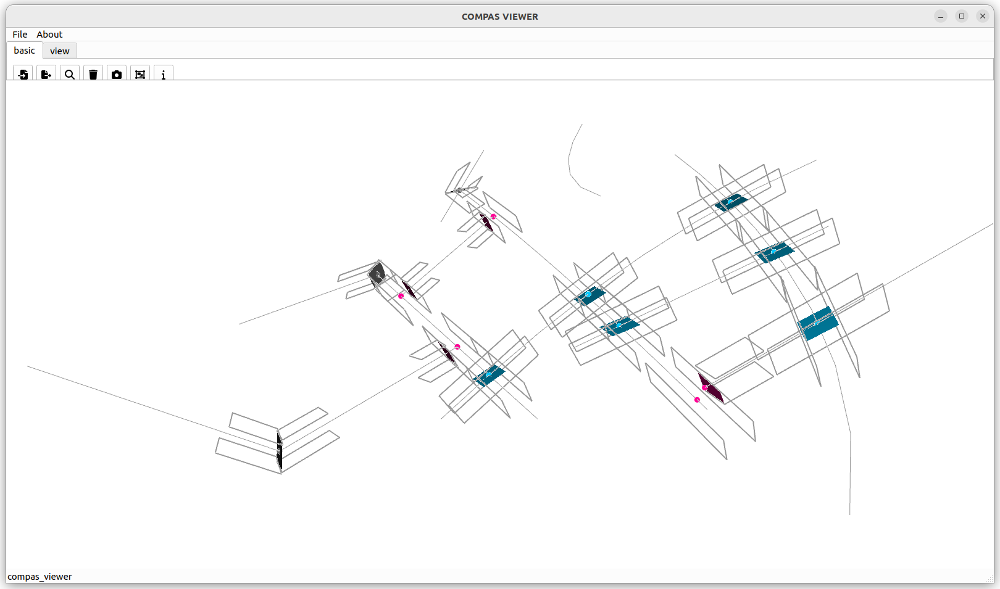

# Beam Volumes Multiple

Example demonstrating beam volume generation with multiple beams.

<figure markdown="span">
  { loading=lazy style="max-height: 400px" }
</figure>

See the full example in `docs/examples/binding_beam_volumes_multiple.py`.
