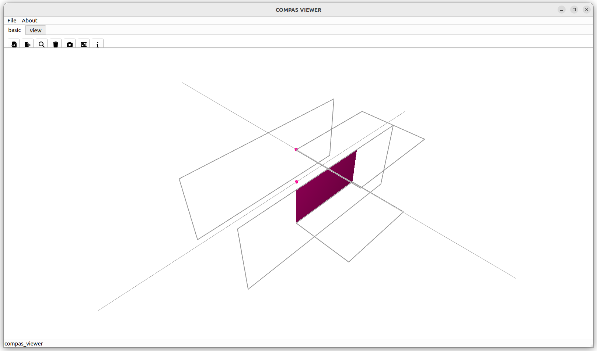

# Beam Volumes Side

Example demonstrating beam volume generation with side joints.

<figure markdown="span">
  { loading=lazy style="max-height: 400px" }
</figure>

See the full example in `docs/examples/binding_beam_volumes_side.py`.
