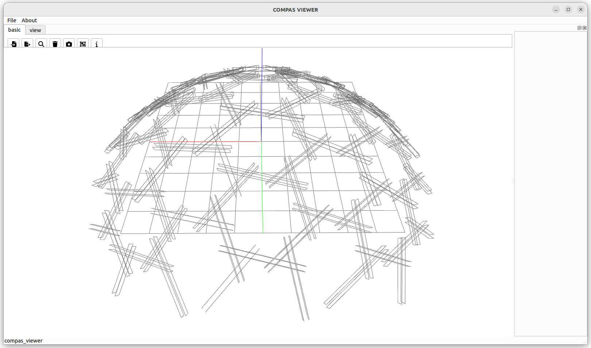

# Read XML Polylines

Example demonstrating reading polylines from XML files.

<figure markdown="span">
  { loading=lazy style="max-height: 400px" }
</figure>

See the full example in `docs/examples/binding_read_xml_polylines.py`.
