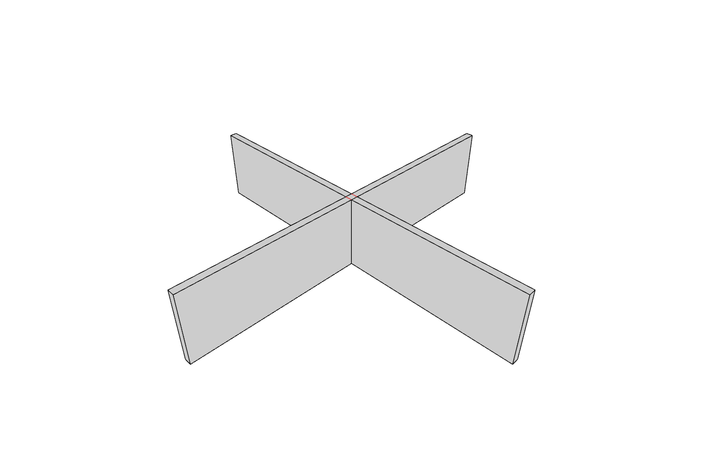
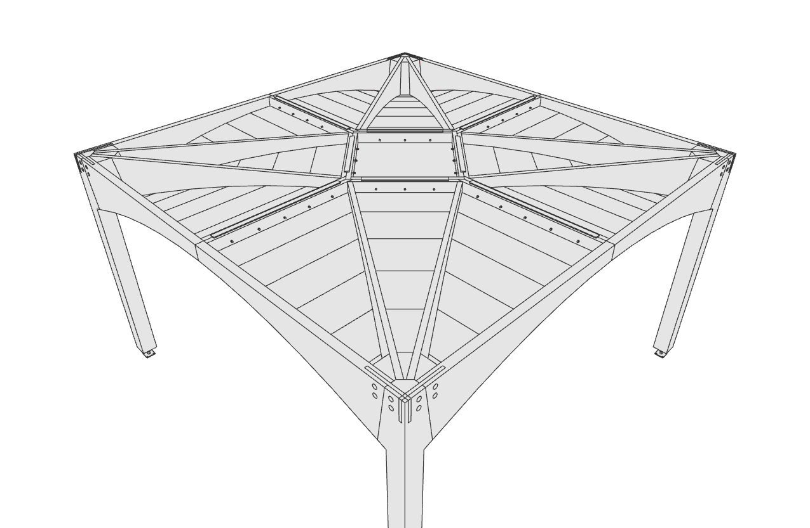

# Breps

wood_nano's contact detection works on **outline polylines**: every plate is a
pair of closed bottom/top loops (plus optional hole loops). CAD models,
however, usually arrive as Breps. The `compas_wood.brep` module (install the
`brep` extra for its [compas_occt](https://github.com/petrasvestartas/compas_occt)
backend) bridges the two worlds: it finds the two large parallel faces of a
plate-like Brep, discretizes their boundary loops into polylines, and pairs
the holes - exactly what a compas_tf-style Brep-native model needs before it
can run wood_nano joinery.

The key functions, documented in the
[API reference](../api/compas_wood.brep.md):

- `plate_faces(brep)` - pick the opposite top/bottom faces of a plate Brep;
- `outline_from_face(face)` - one face to (outer outline, hole outlines),
  with curvature-refined edge discretization;
- `brep_outlines(brep)` - the full plate: bottom/top outlines plus paired
  hole loops;
- `plate_from_brep(brep, plate_id)` - the same, wrapped as a
  [`Plate`](../api/compas_wood.model.md) ready for a `PlateModel`.

The scripts below embed their full source and follow the usual
`compute()` / `draw()` / `main(view=True, **params)` pattern.

## Brep outlines

The conversion step in isolation. An OCC boolean (box minus cylinder) makes a
plate-like solid with a hole; `brep_outlines` extracts the bottom/top outer
outlines, the paired hole outlines and the plate thickness - the exact
polylines the joinery solver consumes. Bottom/top outlines are drawn blue,
hole outlines red. Use it to check that face picking and discretization behave
before running the solver on a real model.


??? example "Source: examples/templates/brep_outlines.py"

    ```python
    --8<-- "examples/templates/brep_outlines.py"
    ```

## Joinery solver from Breps

The full Brep-to-joinery pipeline: `PlateModel.from_breps` converts each Brep
solid's top/bottom plate faces to outline polylines (via `brep_outlines`), so
wood_nano face-to-face / cross detection and joinery generation run on Brep
geometry. Three built-in configs (built with `Brep.from_box`) pick the search
type and exercise one joint family each: `"cross"` (two vertical plates
crossing in an X - `SEARCH_CROSS_JOINT`, family 30-39), `"stack"` (two stacked
overlapping slabs - `SEARCH_FACE_TO_FACE`, top-to-top family 40-49) and
`"corner"` (an L of two plates meeting at an edge - `SEARCH_FACE_TO_FACE`,
top-to-side family 20-29). The displayed meshes are the solver's carved lofts;
the untouched source Breps sit hidden under a "Stock" group (native OCC Brep
display - toggle it on to compare).



??? example "Source: examples/solver/joinery_solver_from_breps.py"

    ```python
    --8<-- "examples/solver/joinery_solver_from_breps.py"
    ```

This mirrors what Brep-native models (e.g. compas_tf timber floors) need: the
Breps stay the authoring geometry, while wood_nano only ever sees the outline
pairs derived from their faces. The solver parameters (`search_type`,
`joint_params`, `joint_volume_ext`) are the same as everywhere else - see the
[solver examples](solver.md).

## Contact detection on the compas_tf floor

Contact **detection** only - no joinery generation. Loads the baked
timber-floor STEP export (`compas_tf/data/cantilevers_baked_model.stp`, 237
solids), keeps the plate-like solids (`PlateModel.from_breps` with
`skip_invalid=True` and `min_pair_fraction=0.2` rejects the curved-dominated
screws and dowels), and runs the wood_nano face-to-face search on their
top/bottom outline polylines. The input Breps are drawn untouched as native
B-reps; the only geometry added is one red filled polygon per detected
contact (`JointResult.area`) - exactly what compas_tf's
`compute_contacts_wood` consumes.

Measured on this model: with relaxed pair tolerances (`angle_tol_deg=30`,
`area_ratio=0.25` for the tapered wedges and t-sections), `pairs="all"` +
`orientations="both"` to close the kernel's representation and orientation
sensitivities, and `slab_faces_min_area` for faces without an opposing partner
(carved pockets, wedge flanks), all 488/488 ground-truth contact pairs are
detected with 0 false positives. Ring pairs alone find 464/488; the wedge
clearance pairs, whose carved solids sit 51.1 mm apart, are design-only
adjacencies that do not physically touch.


??? example "Source: examples/solver/contact_detection_tf.py"

    ```python
    --8<-- "examples/solver/contact_detection_tf.py"
    ```

## Contact detection stress test

The same detection-only display, but on **all** elements of the compas_tf
floor model: relaxed plate extraction brings the tapered wedges, t-sections
and connector solids into the search too, and the search runs `SEARCH_BOTH`
(face-to-face + cross). Every stage (STEP load, plate extraction, solve) is
timed and a joint-type histogram is printed; solids that still have no usable
planar face pair - the screws and dowels rejected by `min_pair_fraction` -
are reported and drawn but excluded from the search. The 488/488 ground-truth
detection result above holds here as well; the only ground-truth pairs not
found are the design-only 51.1 mm wedge clearance pairs.



??? example "Source: examples/solver/contact_detection_tf_stress.py"

    ```python
    --8<-- "examples/solver/contact_detection_tf_stress.py"
    ```

## Comparing against ground truth

`tools/compare_contacts_tf.py` audits the Brep detection against the design
outline pairs exported from the compas_tf model: it draws the untouched Breps
with the **detected** contacts as filled red patches and the **missing** pairs
(in ground truth but not detected from the Breps) as filled yellow patches,
each with a yellow line connecting the two solids' centers. For every missing
pair it prints the carved gap between the solids' bounding boxes, separating
design-only adjacencies (the carved solids do not touch) from real misses.
