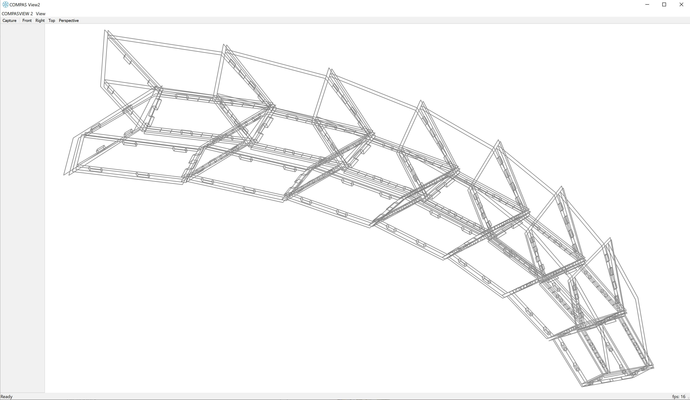

********************************************************************************
tests/compas_wood_5_get_connection_zones.py
********************************************************************************
* **Description:** Get connections zones between elements and generate joinery
* **Output:** Preview of the data-set in compas_view2

.. literalinclude:: ../../tests/compas_wood_5_get_connection_zones.py
    :language: python

**Viewer Output**

