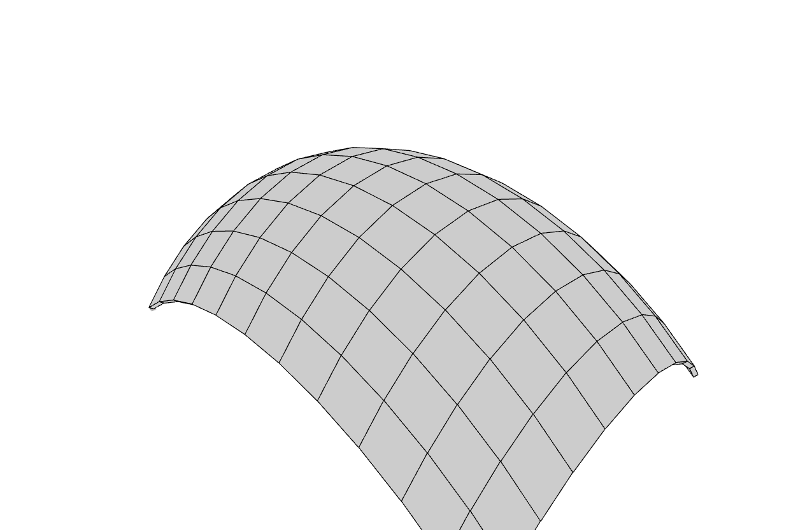
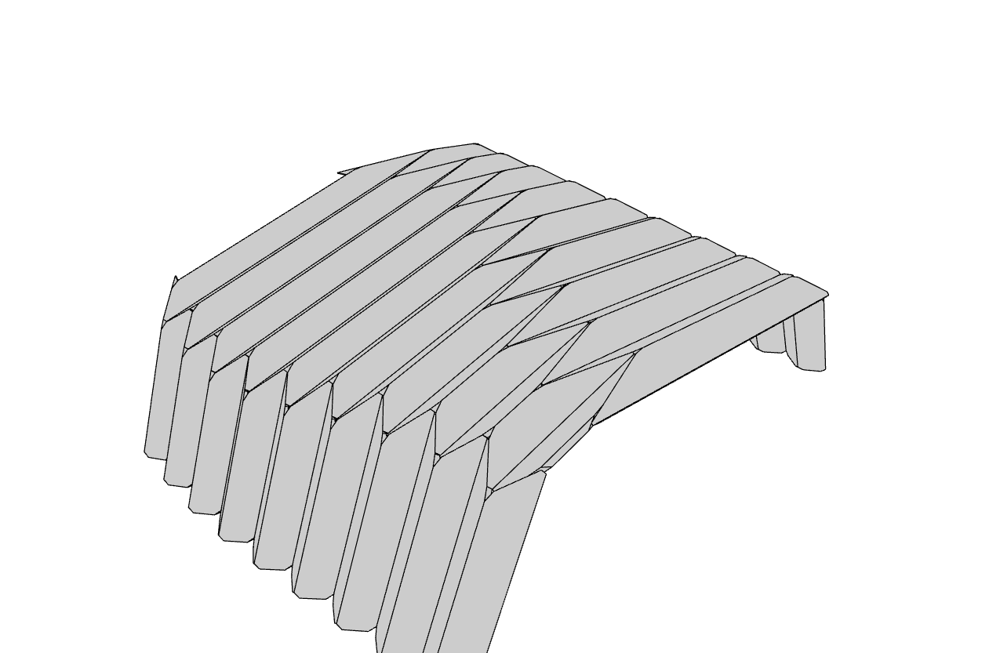
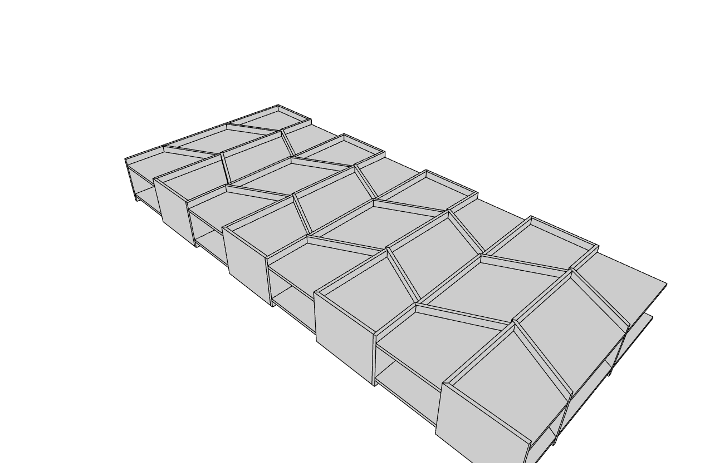
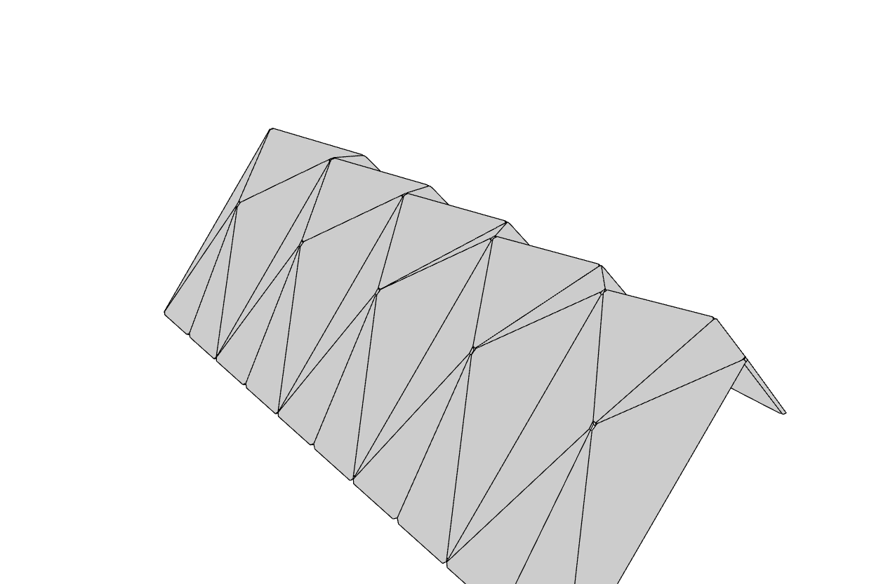
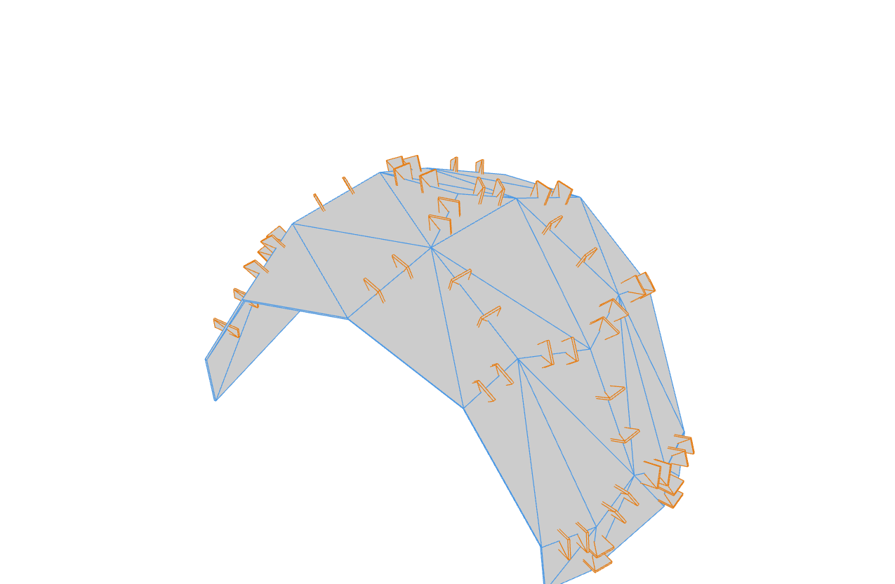
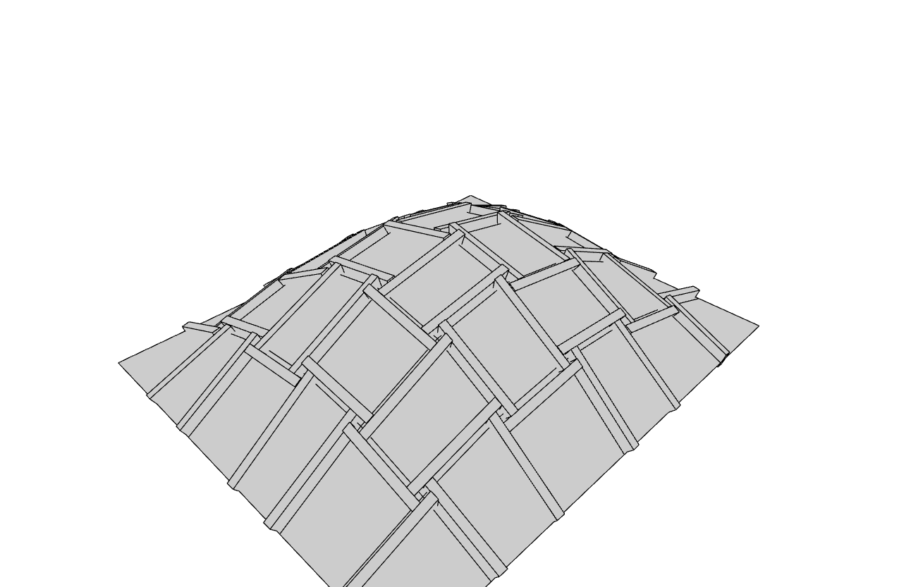
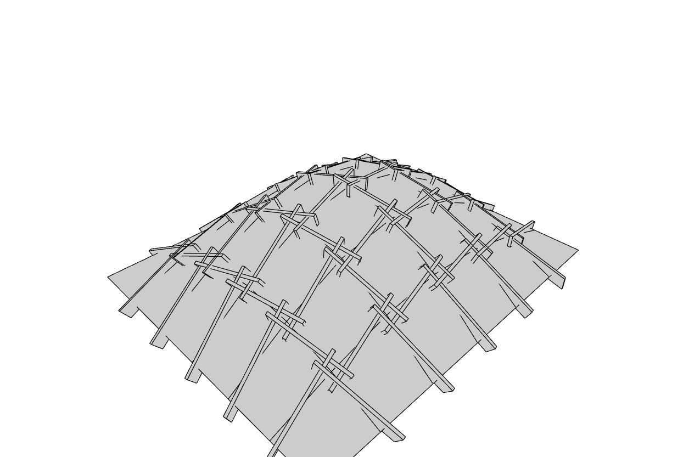
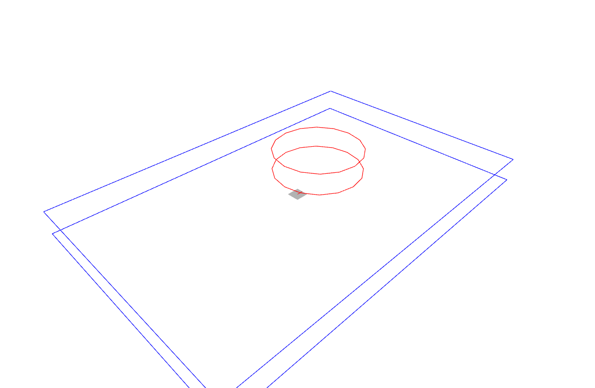

# Templates

The template generators produce plate geometry: a guide shell mesh plus a list
of plate elements (bottom/top outline pairs) ready for the
[joinery solver](solver.md). They mirror the Rhino plugin's `w_template_*`
commands; every script lives in the repository's `examples/` folder and its
full source is embedded below.

Each script follows the same pattern:

- `compute(**params)` builds the geometry and returns the results;
- `draw(scene, results)` adds everything to a scene as one group per plate;
- `main(view=True, **params)` runs both - `view=False` draws into a headless
  [`NullScene`](../api/compas_wood.viewer.md) instead of opening a window.

Run any of them directly, e.g.:

```bash
python examples/templates/translation_shell.py
```

## Hello

The minimal starting point: the kernel's default translation shell (the
built-in arch) drawn as one scene group per plate, each with its loft mesh and
blue bottom/top outlines. No parameters beyond `view` - the shortest possible
compute/draw/main script.



??? example "Source: examples/hello.py"

    ```python
    --8<-- "examples/hello.py"
    ```

## Translation shell

Port of the plugin command `w_template_translation_shell`: sweep a
`cross_section` polyline along a `profile` polyline into a shell of plates.
With both curves `None` the kernel's built-in arch is used. `thickness` sets
the plate depth, `chamfer` and `chamfer_angle` control the corner cuts, and
`explode` draws unwelded plate meshes so the individual plates read clearly.


??? example "Source: examples/templates/translation_shell.py"

    ```python
    --8<-- "examples/templates/translation_shell.py"
    ```

## Reflex fold

Port of the plugin command `w_template_reflex_fold`: a folded shell swept
between two polylines, with the profile folded along the cross-section into
alternating plates. With `cross_section`/`profile` at `None` the kernel's
built-in fold geometry is used; the parameter set (`thickness`, `chamfer`,
`chamfer_angle`, `explode`) matches the translation shell.



??? example "Source: examples/templates/reflex_fold.py"

    ```python
    --8<-- "examples/templates/reflex_fold.py"
    ```

## Chevron

Port of the plugin command `w_template_chevron`. `surface_idx=-1` builds the
chevron boxes on the kernel's built-in flat surface; `0..22` picks one of the
Annen building NURBS surfaces (`chevron_elements_annen`). Besides the shell
and plate elements the generator returns per-plate loft meshes and the chevron
`joint_data` (insertion vectors, joints per face, three-valence groups and
adjacency pairs); when `save` is a path, everything is stored as a
`PlateModel` JSON ready for the solver. Box proportions are controlled by
`u_div`, `v_division_dist`, `box_height`, `top_plate_inlet`,
`plate_thickness`, `edge_rotation`, `edge_offset` and the four
`ortho_edge0..3` flags.



??? example "Source: examples/templates/chevron.py"

    ```python
    --8<-- "examples/templates/chevron.py"
    ```

## Diamond mesh

Port of the plugin command `w_template_diamond_mesh`: diamond-pattern
triangular plates on the kernel's built-in arch surface. Parameters: `u_div`,
`v_div`, `thickness`, `chamfer`, `chamfer_angle`, `explode`.



??? example "Source: examples/templates/diamond_mesh.py"

    ```python
    --8<-- "examples/templates/diamond_mesh.py"
    ```

## Connectors

Port of the plugin command `w_template_connectors`: face plates plus edge
connector rectangles generated from the kernel's default VDA mesh.
`connectors_elements` returns six parallel nested lists (face/edge polylines,
frames and index tags) and `PlateModel.from_connectors` turns the polyline
rows into a plate model; face plates are drawn blue, edge connectors orange.
Parameters: `face_thickness`, `face_positions`, `edge_divisions`,
`edge_division_len`, `insertion_lines`, `rect_width`, `rect_height`,
`rect_thickness`.



??? example "Source: examples/templates/connectors.py"

    ```python
    --8<-- "examples/templates/connectors.py"
    ```

## Reciprocal move

Port of the plugin command `w_template_reciprocal_move`: a translation-based
reciprocal frame (nexorade) on the kernel's sinusoidal dome. The plugin's
`u_div`/`v_div`/`move` map to the wrapper's `nx`/`ny`/`angle`; the beams and
their side polylines are collected with `PlateModel.from_beams`. Further
parameters: `mesh_type` (`"quad"`, `"hex"`, ...), `beam_w`, `beam_h`,
`beam_offsets` (per-direction-group Z shifts) and `explode`.



??? example "Source: examples/templates/reciprocal_move.py"

    ```python
    --8<-- "examples/templates/reciprocal_move.py"
    ```

## Reciprocal rotation

Port of the plugin command `w_template_reciprocal_rotation`: the
rotation-based reciprocal frame on the same sinusoidal dome - the beams rotate
around their midpoints instead of translating. The plugin's
`u_div`/`v_div`/`cut_offset` map to `nx`/`ny`/`cut_offset_factor`; `W`, `D`,
`h` size the dome and `angle` sets the rotation.



??? example "Source: examples/templates/reciprocal_rotation.py"

    ```python
    --8<-- "examples/templates/reciprocal_rotation.py"
    ```

## Brep outlines

The minimal Brep-to-outlines conversion demo: an OCC boolean (box minus
cylinder) makes a plate-like solid with a hole, and `brep_outlines` extracts
the bottom/top outer outlines, the paired hole outlines and the plate
thickness - the exact polylines the joinery solver consumes. Bottom/top
outlines are drawn blue, hole outlines red. See the
[Brep workflow](breps.md) for the full pipeline.



??? example "Source: examples/templates/brep_outlines.py"

    ```python
    --8<-- "examples/templates/brep_outlines.py"
    ```

## Next step

Feed any template's elements to the joinery solver - see the
[solver examples](solver.md) - or convert Breps to plates first with the
[Brep workflow](breps.md).
