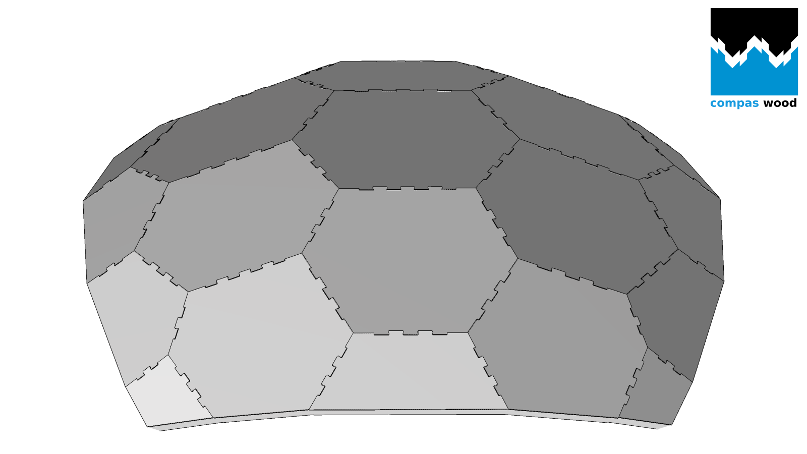

# compas_wood



`compas_wood` is the [COMPAS](https://compas.dev) interface to the
[wood_nano](https://github.com/petrasvestartas/wood_nano) timber joinery
kernel: it generates plate shells, detects the joints between neighbouring
plates, and returns the joint-carved outlines and cut volumes ready for
fabrication.

The stack has three layers:

1. **wood** - the C++ library that does all the work: plate elements, joinery
   detection, joint volume generation, lofting.
2. **wood_nano** - nanobind bindings of wood, published as a compiled wheel.
3. **compas_wood** (this package) - a pure-Python layer that converts between
   COMPAS types (`Polyline`, `Mesh`) and the kernel's raw containers. No
   computation happens here.

## Quick example

```python
from compas_wood import translation_shell_elements, joinery_solver_elements

# Sweep a cross-section along a profile into a shell of plate elements
# (no arguments = the built-in arch).
shell_mesh, elements = translation_shell_elements()

# Detect joinery between the plates and get back merged, joint-carved outlines.
plates, joints = joinery_solver_elements(
    bottom_polylines=[e.bottom for e in elements],
    top_polylines=[e.top for e in elements],
)

# Optional: draw the result (pip install compas_wood[viewer]).
from compas_viewer import Viewer
from compas_wood.viewer import add_joinery

viewer = Viewer()
add_joinery(viewer.scene, plates, joints, draw_meshes=True)
viewer.show()
```

## Where to go next

- [Installation](installation.md) - `pip install compas_wood` and the
  build-from-source route for `wood_nano`.
- [Migration from 2.x](migration.md) - 3.0 is a clean break; the table there
  maps every removed 2.x function to its replacement.
- [Examples](examples/templates.md) - the template generators, the
  [joinery solver](examples/solver.md), and the
  [Brep workflow](examples/breps.md).
- [API Reference](api/index.md) - one page per module.

## Rhino / Grasshopper

A Rhino plugin also named **compas_wood** ships from the
[wood_nano](https://github.com/petrasvestartas/wood_nano) repository via the
Yak package manager. It does not depend on this Python package.
