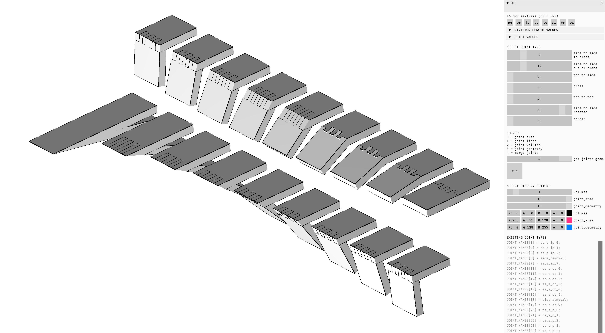
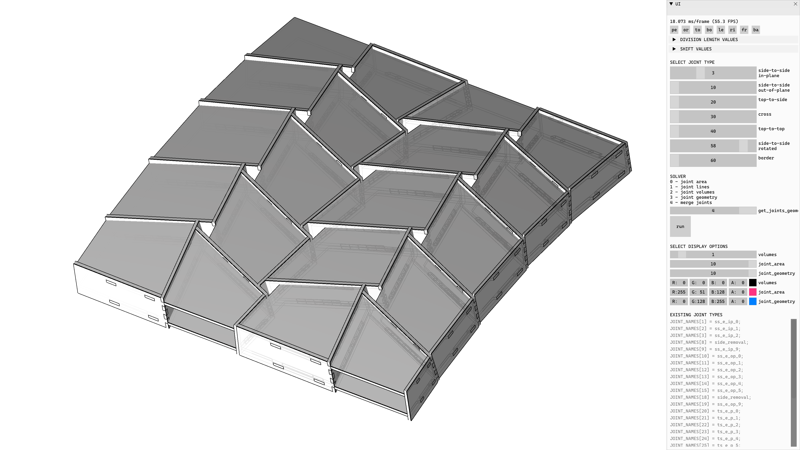

.. figure:: /_images/logo/compas_wood_website_logo.jpg
    :figclass: figure
    :class: figure-img img-fluid 
    :width: 300

.. rst-class:: lead

.. .. figure:: /_images/
     :figclass: figure
     :class: figure-img img-fluid

Author: `Petras Vestartas <http://www.petrasvestartas.com/>`_.

Table of Contents
=================

.. toctree::
   :maxdepth: 3
   :titlesonly:

   Introduction <self>
   about
   installation
   examples
   tutorials
   api
   license
   citation

Gallery
=======

.. image:: _images/data_sets/type_plates_name_side_to_side_edge_inplane_hexshell.png
    :width: 100%

.. image:: _images/data_sets/type_plates_name_cross_and_sides_corner.png
    :width: 100%

.. image:: _images/data_sets/type_plates_name_cross_corners.png
    :width: 100%

.. image:: _images/data_sets/type_plates_name_cross_ibois_pavilion.png
    :width: 100%

.. image:: _images/data_sets/type_plates_name_cross_square_reciprocal_iseya.png
    :width: 100%

.. image:: _images/data_sets/type_plates_name_cross_square_reciprocal_two_sides.png
    :width: 100%

.. image:: _images/data_sets/type_plates_name_cross_vda_corner.png
    :width: 100%
    :align: center

.. image:: _images/data_sets/type_plates_name_cross_vda_hexshell.png
    :width: 100%

.. image:: _images/data_sets/type_plates_name_cross_vda_hexshell_reciprocal.png
    :width: 100%

.. image:: _images/data_sets/type_plates_name_cross_vda_shell.png
    :width: 100%

.. image:: _images/data_sets/type_plates_name_cross_vda_single_arch.png
    :width: 100%

.. image:: _images/data_sets/type_plates_name_hexbox_and_corner.png
    :width: 100%

.. image:: _images/data_sets/type_plates_name_joint_linking_vidychapel_corner.png
    :width: 100%

.. image:: _images/data_sets/type_plates_name_joint_linking_vidychapel_full.png
    :width: 100%

.. image:: _images/data_sets/type_plates_name_joint_linking_vidychapel_one_axis_two_layers.png
    :width: 100%

.. image:: _images/data_sets/type_plates_name_joint_linking_vidychapel_one_layer.png
    :width: 100%

.. image:: _images/data_sets/type_plates_name_side_to_side_edge_inplane_2_butterflies.png
    :width: 100%

.. image:: _images/data_sets/type_plates_name_side_to_side_edge_inplane_differentdirections.png
    :width: 100%

.. image:: _images/data_sets/type_plates_name_side_to_side_edge_inplane_outofplane_simple_corners_combined.png
    :width: 100%

.. image:: _images/data_sets/type_plates_name_side_to_side_edge_inplane_outofplane_simple_corners_different_lengths.png
    :width: 100%

.. image:: _images/data_sets/type_plates_name_side_to_side_edge_outofplane_box.png
    :width: 100%

.. image:: _images/data_sets/type_plates_name_side_to_side_edge_outofplane_dodecahedron.png
    :width: 100%

.. image:: _images/data_sets/type_plates_name_side_to_side_edge_outofplane_folding.png
    :width: 100%

.. image:: _images/data_sets/type_plates_name_side_to_side_edge_outofplane_icosahedron.png
    :width: 100%

.. image:: _images/data_sets/type_plates_name_side_to_side_edge_outofplane_inplane_and_top_to_top_hexboxes.png
    :width: 100%

.. image:: _images/data_sets/type_plates_name_side_to_side_edge_outofplane_octahedron.png
    :width: 100%

.. image:: _images/data_sets/type_plates_name_side_to_side_edge_outofplane_tetra.png
    :width: 100%

.. image:: _images/data_sets/type_plates_name_top_to_side_and_side_to_side_outofplane_annen_box.png
    :width: 100%

.. image:: _images/data_sets/type_plates_name_top_to_side_and_side_to_side_outofplane_annen_box_pair.png
    :width: 100%

.. image:: _images/data_sets/type_plates_name_top_to_side_and_side_to_side_outofplane_annen_corner.png
    :width: 100%

.. image:: _images/data_sets/type_plates_name_top_to_side_and_side_to_side_outofplane_annen_grid_full_arch.png
    :width: 100%

.. image:: _images/data_sets/type_plates_name_top_to_side_box.png
    :width: 100%

.. image:: _images/data_sets/type_plates_name_top_to_side_corners.png
    :width: 100%

.. image:: _images/data_sets/type_plates_name_top_to_side_pairs.png
    :width: 100%

.. image:: _images/data_sets/type_plates_name_top_to_top_pairs.png
    :width: 100%

Last update: 2020-03-14

