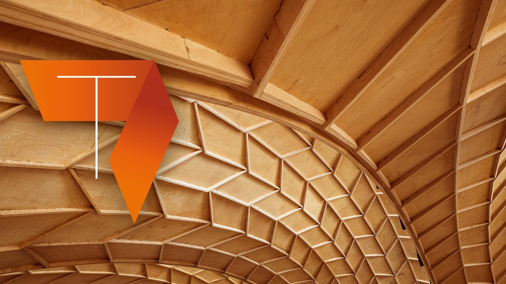

# Introduction

This is the tutorial complementary to the EdX course: [Advanced Timber Plate Structural Design](https://www.edx.org/learn/architecture/ecole-polytechnique-federale-de-lausanne-advanced-timber-plate-structural-design).

## Overview

- Introduction
- Geometrical generation of Timber Plate Shells
- Joinery methods in timber plates
- Exercise and Solution
- Conclusion

## Description

Firstly, an in-depth introduction is given of the double layer timber plate system. The Annen Head office geometry is explained from the conceptual architectural scale, NURBS subdivision, plate thickness generation to the scale of joinery and assembly. Secondly, a tutorial is given using Grasshopper plug-in "compas_wood" to explain how dovetail and tenon mortise joints are generated. The joinery generation is explained step by step from local small-scale models to box components to the final arch geometry. Then a similar version of code will be shown as a standalone python package using "Visual Studio" code editor. Afterwards, a more generalized overview is given how timber joinery is generated between different types of timber structures including plates, beams and raw timbers. The examples are given both in a format of slides and practical examples. Lastly, fabrication tools will be introduced to optimize the placement of parts within CNC machine and generate a tool-path.

## Objectives

- Understand geometrical operations needed to transform NURBS to fabrication and assembly aware geometry for the segmented timber arch.
- Describe modelling technique of the joints using Grasshopper Plug-in compas_wood.
- Explain tenon-mortise and dovetail joinery within the box component.
- Understand the design input of the double layer timber shell and the detailed process of the timber joinery generation including the three-valence connection.
- Install compas_wood.
- Understand how pair-wise timber joints are generated.
- Understand how joinery can be generated for cases such as planar timber shell, folded plate system, etc.
