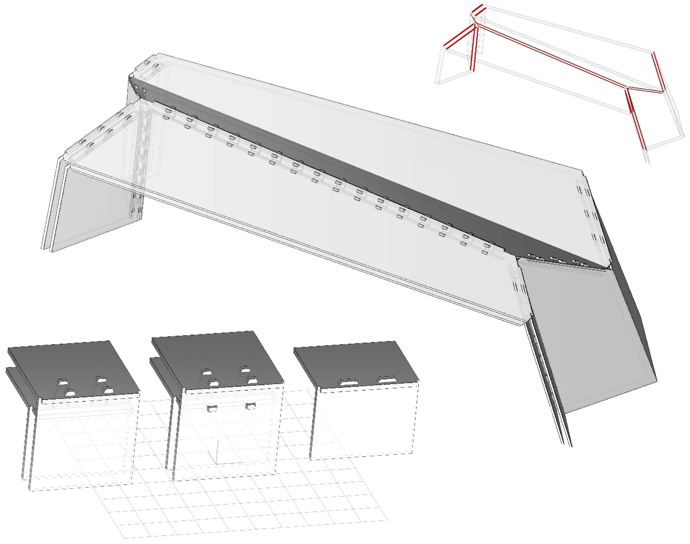
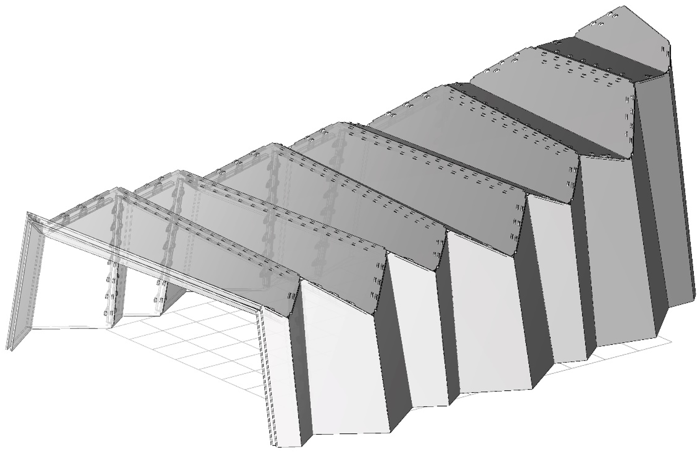
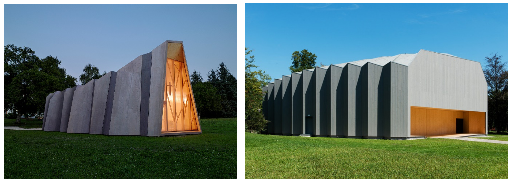

# Exercise

## Explanation

- Download the files [4_exercise.3dm](4_exercise.3dm).
- Open each file.
- Generate wood-wood connections to obtain the result similar to figure 4.1. Use the input geometry given in the Grasshopper3D file. The double layer system of the St. Loup Chapel was originally connected using metal plates at each edge. In future projects such as Vidy theatre, wood-wood connections were introduced in IBOIS research. The goal of this task is to apply timber joinery to the St. Chapel as if it would be built like the Vidy theater.

*Fig. 4.1 Timber Joinery from the Vidy theater applied to St. Loup Chapel*

*Fig. 4.2 The St. Loup Chapel and Vidy theater*

## Solutions

- [user_objects.zip](user_objects.zip) — Grasshopper user objects to install in Rhino. Unzip and drag and drop all of the on Grasshopper canvas.
- [examples.zip](examples.zip) — Grasshopper files with solved connections.
