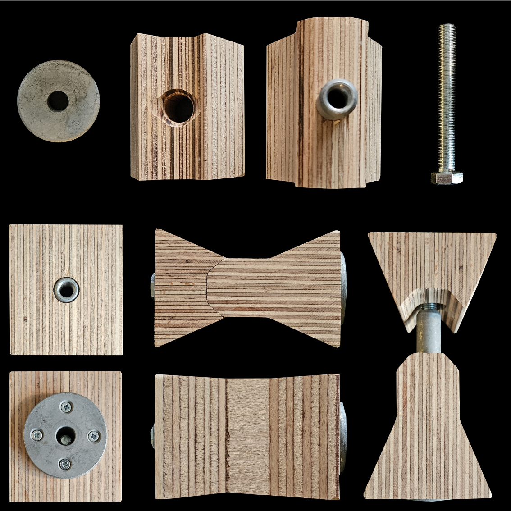
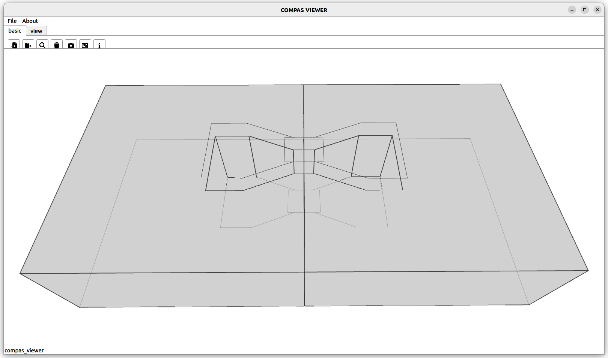
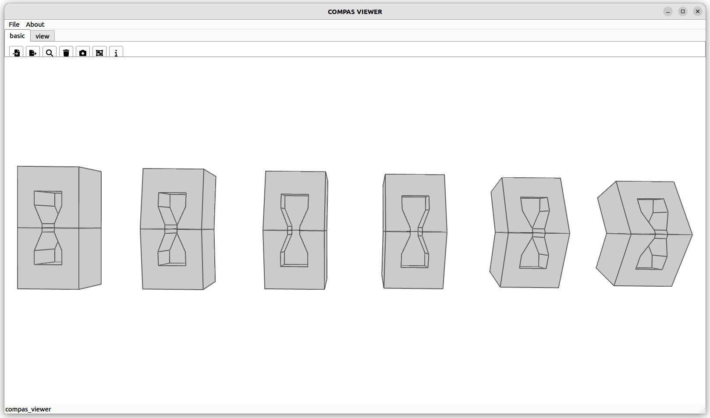
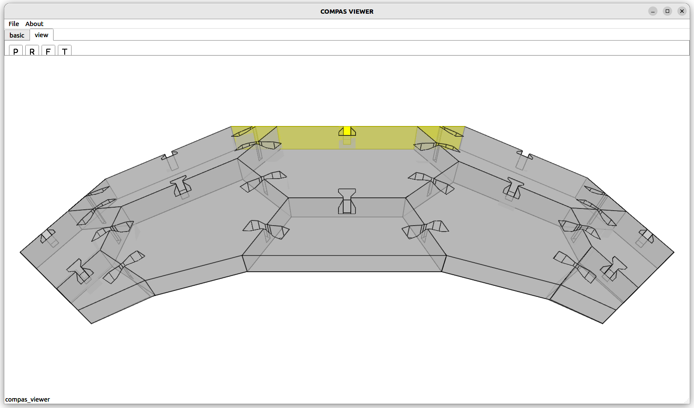
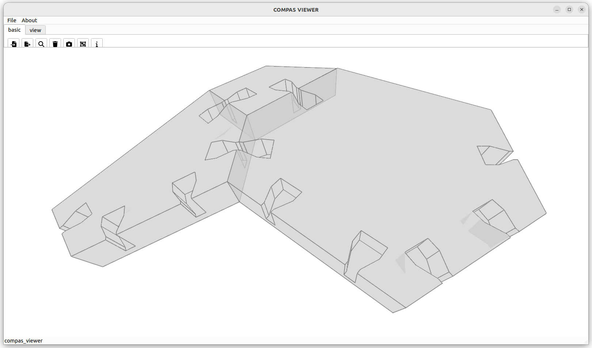
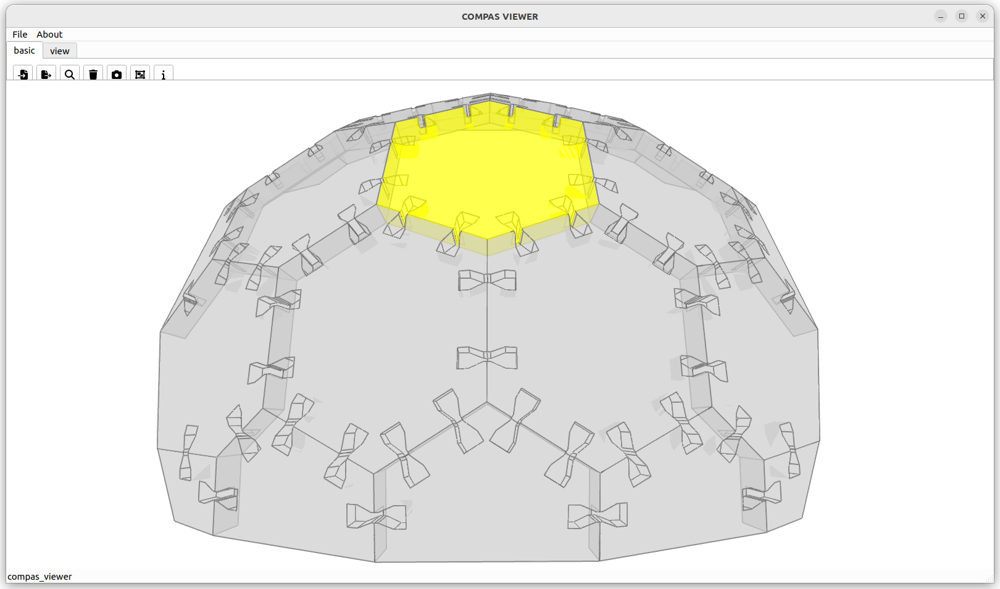
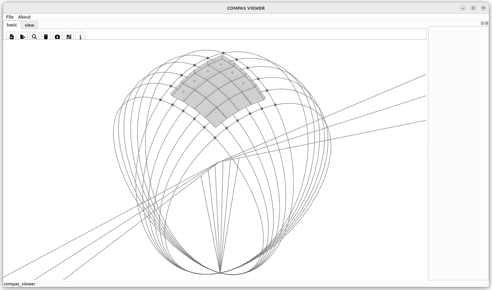
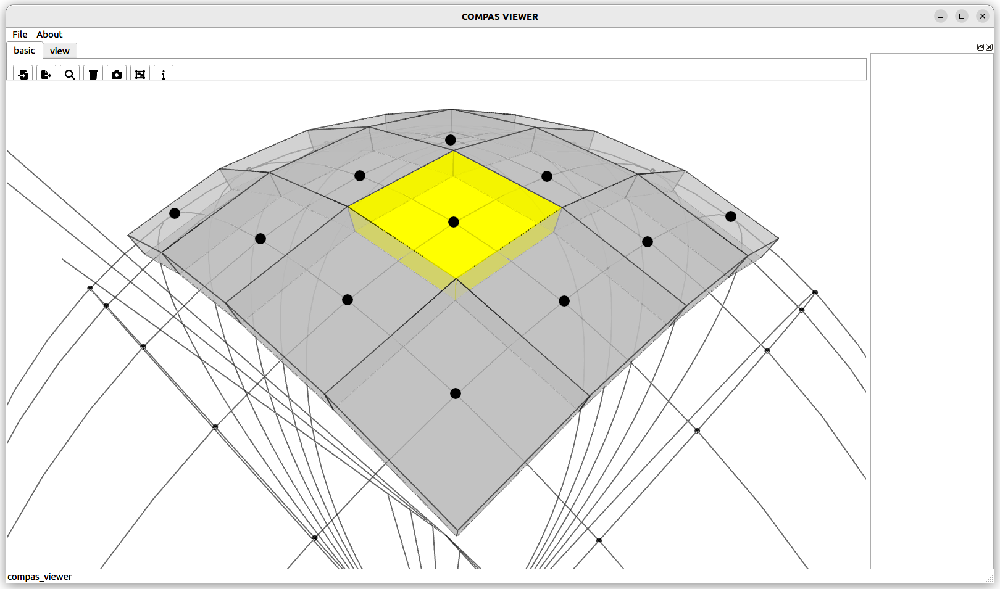
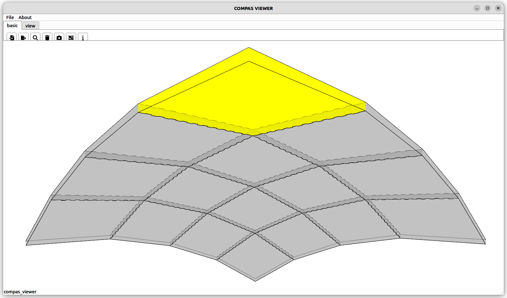
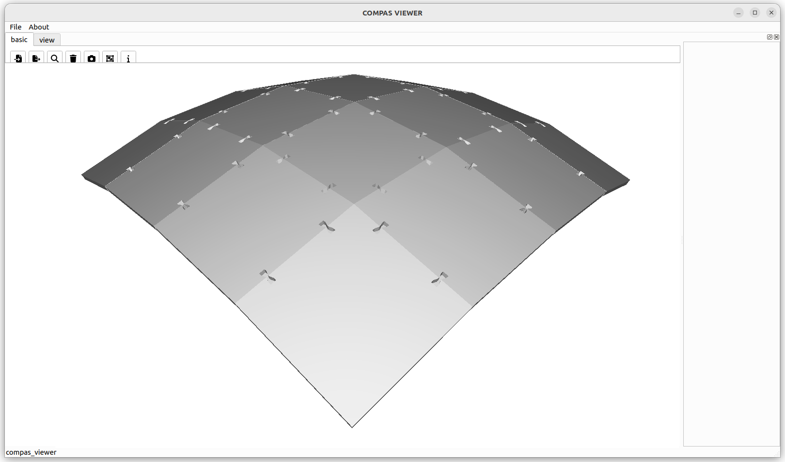

# Hilti CLT Connectors Tutorial

This tutorial focuses on Hilti CLT connectors. The objective is to demonstrate how to create a model consisting of pairs of polylines that represent timber plates, detect the interfaces between these plates, and create connectors.

## Scope

- We begin with simple pairwise connections.
- Then, we apply the process to a planar hexagonal shell.
- Finally, we test the process on a planar quad shell.

The connector requires a 240x90x93 mm cutout. The LVL timber element measures 128x78.5x90 mm, and the inner thin part is 27.7x40x90 mm. The angles are set at 45 degrees, and the cuts are made with a router with a diameter of up to 40 mm. The minimum distance between two connectors is 300 mm, and the maximum is 3000 mm; the minimum distance to a corner is 300 mm, and the minimum CLT thickness is 120 mm. It can withstand tensile forces of up to 35 kN and shear forces of up to 40 kN.

## Single pair

## Multiple pairs in varying angles

## Hexagonal shell

## Planarized quad shell

Mesh dual of a cone and a sphere intersection:

Rescale the mesh to 8000 mm and apply joinery:

