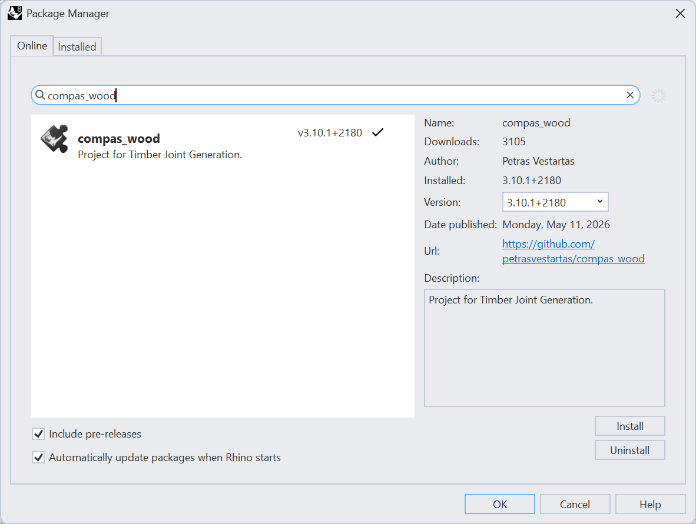
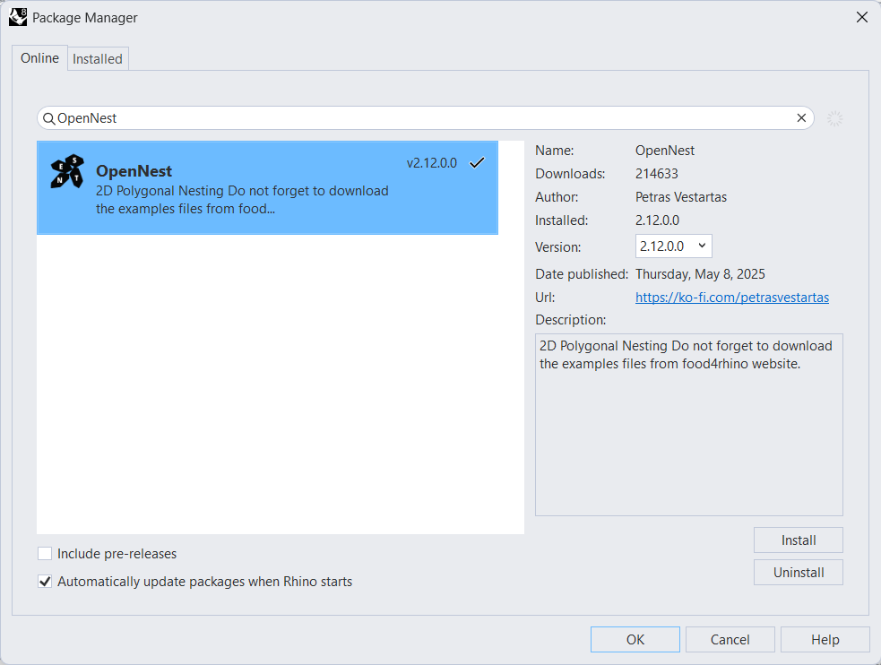

# HSLU Workshop

Workshop materials for timber plate joinery and 2D nesting using **compas_wood** and **OpenNest** in Rhino/Grasshopper.

## Downloads

- [Tutorial_compas_wood.zip](Tutorial_compas_wood.zip)
- [Tutorial_opennest.zip](Tutorial_opennest.zip)

---

## Plugin Installation via Rhino Package Manager

Open Rhino and go to **Tools > Package Manager**. Search for the plugin and click **Install**.

**compas_wood**

**OpenNest**

---

## compas_wood

Timber plate joinery types supported by compas_wood.

---

## OpenNest

2D nesting operations available in OpenNest.

