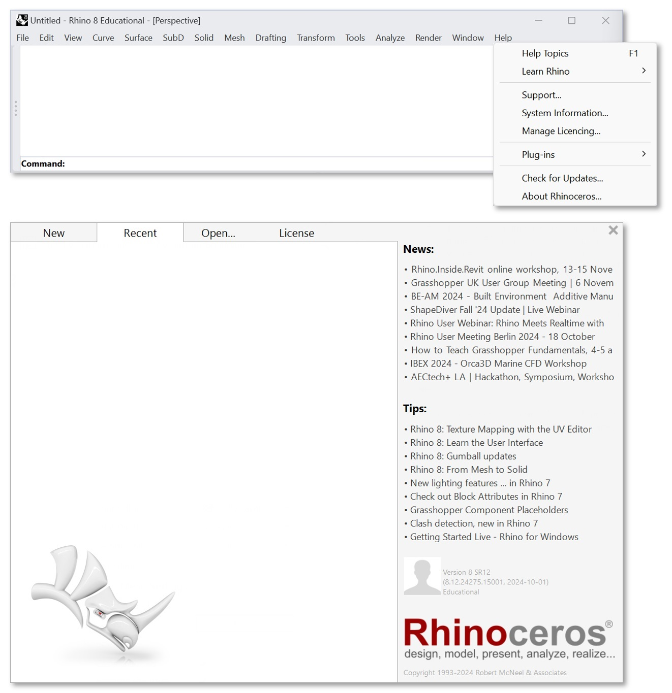

# Requirements

## Rhino Version

Latest version of Rhino is required. If you have a version older than [Rhino 8.12](https://www.rhino3d.com/download/), please update it.

You can check your Rhino version as follows:

1. "Help" menu item
2. "About Rhinoceros" sub-menu item
3. Check the bottom right corner of the splash screen e.g. "Version 8 SR 12"



## Rhino Plugin Installation

Run test script to check if the plugin can be installed on your computer:

1. Open "ScriptEditor"
2. Create a new "Python 3 script"
3. Run the following code:

```python
import compas_wood
print(compas_wood.__version__)
```

!!! attention
    There should be no errors, otherwise, write a message to petrasvestartas@gmail.com with your Rhino version number and operating system version (e.g., Windows 11 or Mac with Intel or M chip). Include a screenshot of the error message.
