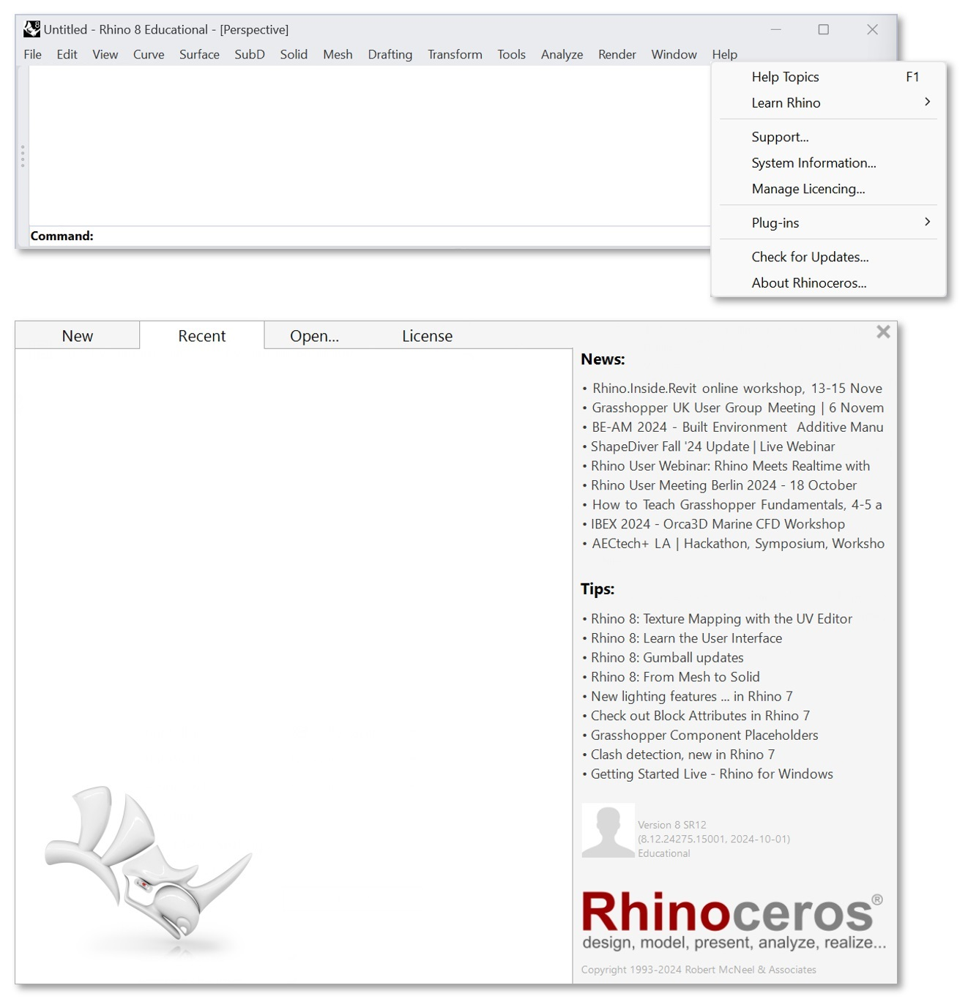

********************************************************************************
Requirements
********************************************************************************
- Latest version of Rhino:
    - If you have a version older than `Rhino 8.12 <https://www.rhino3d.com/download/>`_, please update it.

- You can check your Rhino version as follows:
    - "Help" menu item.
    - "About Rhinoceros" sub-menu item.
    - Check the bottom right corner of the splash screen e.g. "Version 8 SR 12".

--------------------------------------------------------------------------------
Rhino Plugin Installation
--------------------------------------------------------------------------------

- Run test script to check if the plugin can be installed on your computer:

  - open "ScriptEditor"
  - create a new "Python 3 script"
  - run the following code.

.. attention::

    There should be no errors, otherwise, write a message to petrasvestartas@gmail.com with your Rhino version number and operating system version (e.g., Windows 11 or Mac with Intel or M chip). Include a screenshot of the error message.

.. literalinclude:: ./test.py
   :language: python