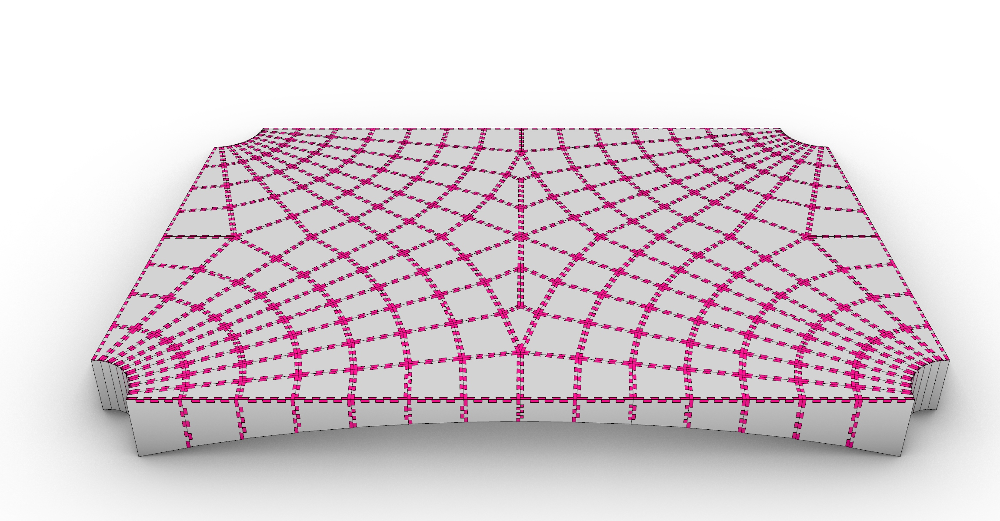
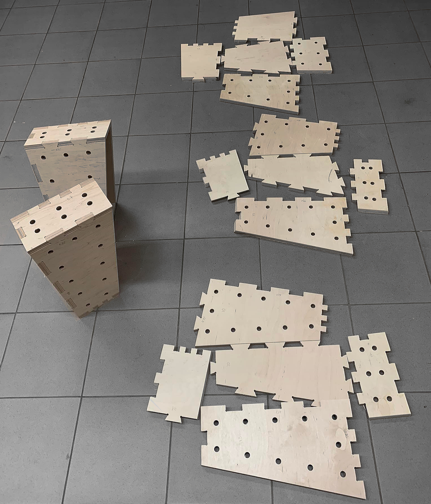
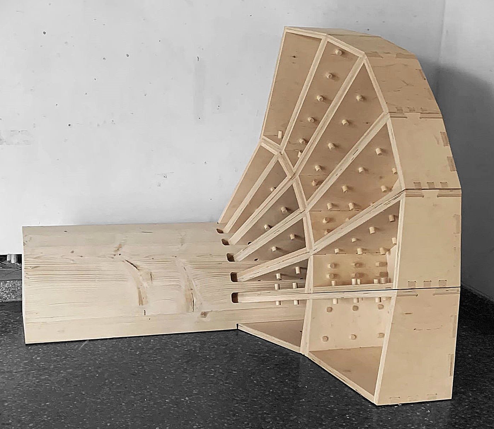

********************************************************************************
Slab from Boxes
********************************************************************************

Teaching MA student Egle Dimaityte

`Download the built version for this workshop, slides and examples files <https://github.com/petrasvestartas/compas_wood/blob/main/src/grasshopper/vda_slab.zip>`_

.. image:: ../_images/workshops/vda_slab/timber_slab_0.jpg
    :width: 100%
    :align: center

.. image:: ../_images/workshops/vda_slab/timber_slab_3.jpg
    :width: 100%
    :align: center

.. image:: ../_images/workshops/vda_slab/timber_slab_4.jpg
    :width: 100%
    :align: center

.. image:: ../_images/workshops/vda_slab/timber_slab_5.jpg
    :width: 100%
    :align: center

.. image:: ../_images/workshops/vda_slab/timber_slab_6.jpg
    :width: 100%
    :align: center

.. image:: ../_images/workshops/vda_slab/timber_slab_7.jpg
    :width: 100%
    :align: center

.. image:: ../_images/workshops/vda_slab/timber_slab_8.jpg
    :width: 100%
    :align: center

.. image:: ../_images/workshops/vda_slab/timber_slab_9.jpg
    :width: 100%
    :align: center

.. image:: ../_images/workshops/vda_slab/timber_slab_11.jpg
    :width: 100%
    :align: center

.. image:: ../_images/workshops/vda_slab/timber_slab_12.jpg
    :width: 100%
    :align: center

